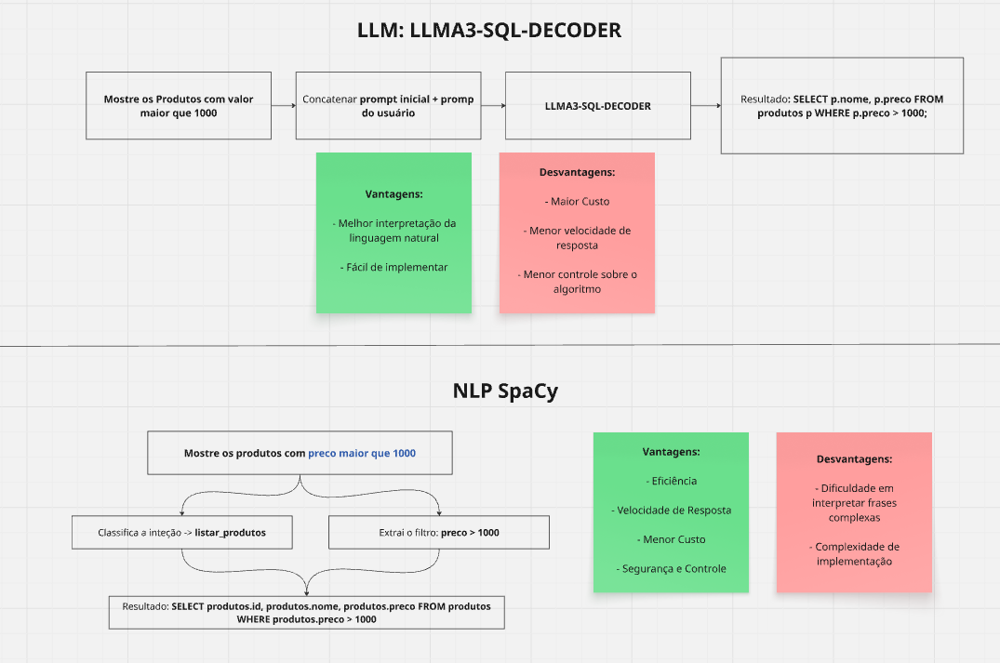
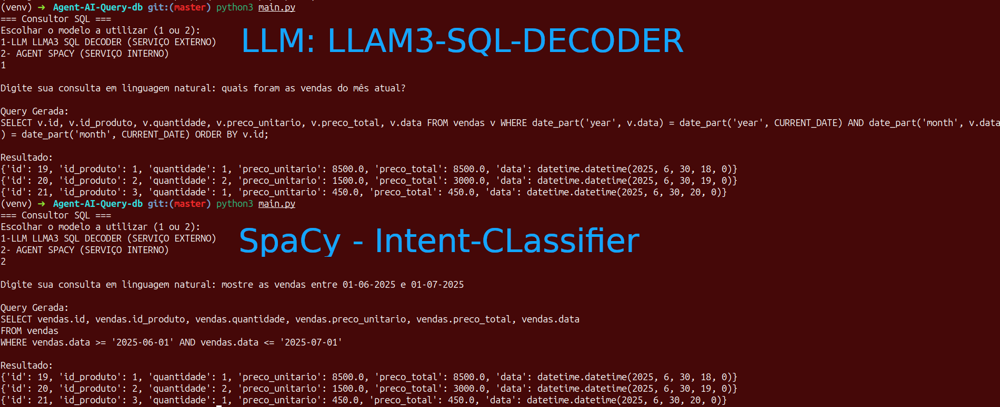

# Tradução de linguagem natural em consultas SQL (IA)

O objetivo deste projeto foi desenvolver uma IA capaz de traduzir um texto em linguagem natural para uma consulta em banco de dados, essa abordagem se mostra uma solução com alto potencial para bots de atendimento, assistentes inteligentes e sistemas de suporte que respondem a comandos em linguagem natural.  
  
Para esse desafio, desenvolvi duas soluções: um agente de IA externo (LLM) e outro agente de NLP para classificação de intenção e extração de filtros semânticos. 



## Tecnologias

+ Python
+ Hugginface
+ SpaCy
+ SQLAlchemy

## LLMA3-SQL-Decoder

Esse modelo consiste na conexão do modelo da meta LLAMA3-SQL-DECODER via api Hugginface. a ideia desse agent é realizar uma implementação simples e robusta, mas que contém menos controle sobre o algoritmo e um custo para utiliza-lo.

## NLP SpaCy

Esse Modelo foi construído para manter mais controle sobre o algoritmo e eliminar a dependência de um LLM. Foi treinado um modelo com frases genéricas para classificar a intenção (listar_produto, listar_vendas, etc). Com esse modelo treinado, utilizamos para classificar a intenção do usuário, juntamente utilizamos outro algoritmo SpaCy para extrair filtros semânticos de acordo com nome das colunas no banco de dados.

## Configuração do Ambiente

### 1. Clone o repositório

```bash
git clone https://github.com/seu-usuario/seu-projeto.git](https://github.com/Alisson-tech/Agent-AI-Query-db.git
cd Agent-AI-Query-db
```
### 2. crie o .env

DB_USER=postgres  
DB_PASSWORD=admin  
DB_HOST=localhost  
DB_PORT=5432  
DB_NAME=lojadb  
HUGGINGFACE_API_TOKEN= key_hugginface  

### 3. Crie e ative o ambiente virtual

```bash
python3 -m venv venv
source venv/bin/activate
```
### 4. Instalar depedências

```bash
pip install -r requirements.txt
```

### 5. Suba o container

```bash
docker-compose up -d
```

### 6. Rodar o projeto

```bash
python3 main.py
```


o projeto conta com duas tabelas produtos e vendas, essas tabelas possuem dados gerados inicialmente pelo app. O aplicativo funciona no terminal/cmd, ao rodar o app ele pergunta qual agent você quer utilizar. O primeiro é mais robusto mais depende da chave do Hugginface, o segundo funciona por conta própria. Existe pequenos bugs nos algoritmos e deveria ser treinado com mais dados, abaixo anexo exemplos de prompt.

- Informe os produtos
- Mostre os produtos com preco maior que 1000
- Mostre as vendas
- Mostre as vendas entre 01-01-2025 a 01-02-2025
- Mostre a quantidade de vendas
- Exiba o faturamento total de vendas


